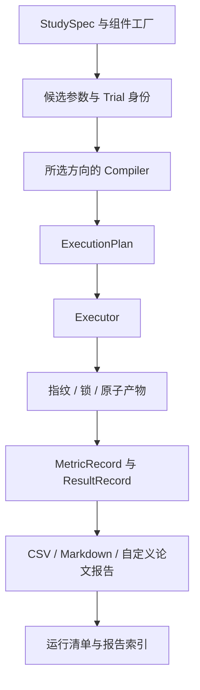

# 架构与任务流转

> Last Updated: 2026-09-12; imported from PaperTemplate (Agent profile).

| 层 | 职责 | 允许的依赖 |
|---|---|---|
| `framework` | 配置、组件加载、搜索、DAG、缓存、身份、统计、报告、CLI、调度、导出 | 标准库与基础依赖；不能导入方向实现 |
| `workflows.<profile>` | 方向数据契约、流程编译、专用结果和评估 | 公共核心；不能导入另一个方向 |
| `project` | 具体数据、网络、模型、工具、索引、评分器和报告 | 公共核心与本工程所选方向 |

公共运行入口按 `profile` 精确导入一个 compiler。组件按配置的 `module:callable` 路径加载，不扫描项目模块。Hydra、PyTorch、sklearn、Graphviz 不在默认导入链中。

方向 compiler 构建 DAG 节点，节点声明配置、实现指纹、依赖、随机条件、产物格式和资源。执行器先解析所有节点身份，复用完整缓存；需要执行的节点写临时目录，成功后原子提交。失败没有成功标记，其余已完成节点可以继续被复用。

方向流程：

- 深度学习：数据视图与划分 → 训练 → 预测 → 评分与 OOF 汇总；嵌套选择插入内层训练、验证评分、选择和外层重拟合。
- Agent：准备任务清单 → 每个 Case/Repeat 的有界循环 → 结果与轨迹 → 独立评分；选择模式先完成开发集评分。
- RAG：文档快照 → 解析 → 切分 → 索引 → 检索 → 可选生成 → 评分。索引属于语料，生成属于问题与重复运行。

数据加载与划分在编译时进行，便于准确规划缓存。加载器应只读取输入数据、必要元数据与已有资源；训练、远程模型调用和索引构建必须放在执行节点中。`validate` 和 `plan` 都会调用加载器，因此它不是一个只校验 YAML 语法的命令。

报告单独编译，并以所读产物的身份作为依赖。`plan` 同时列出方向节点和报告。报告回调只读取已提交输入；不会重建预测、重新调用模型或修改原结果。

本地默认串行。Agent/RAG 可用线程执行独立节点；组件必须保证自身线程安全。深度学习禁止同一进程的多线程训练，用独立 worker 或 Slurm 分离 Python 状态和随机数生成器。
